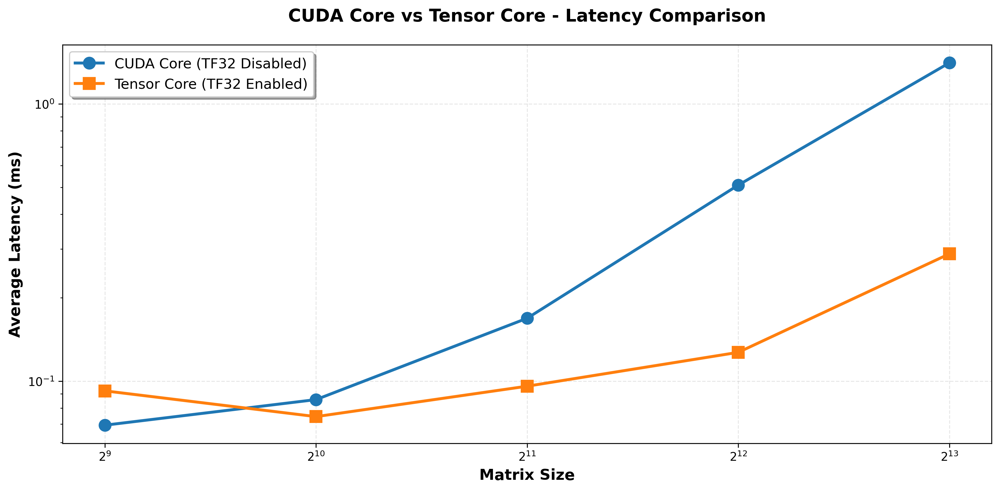
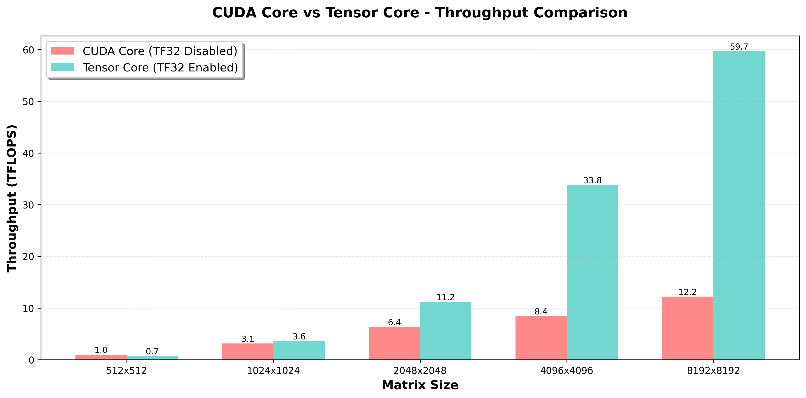
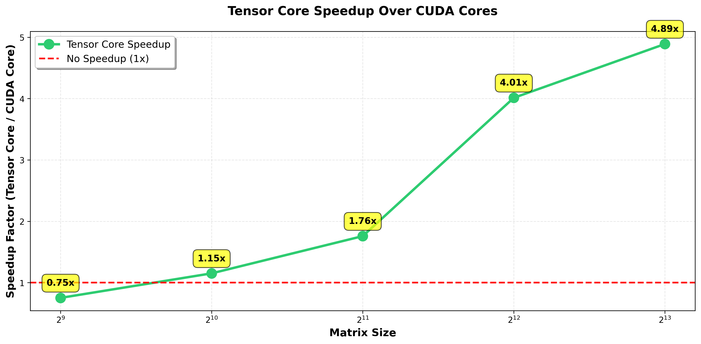

# CUDA Core vs Tensor Core Performance Benchmark

## Homework 1 - Excellent Option
**Course**: CMPE 258 - Software Engineering Spring 2026

## Overview
This project benchmarks the performance difference between traditional CUDA cores and modern Tensor Cores for matrix multiplication operations in fully connected neural network layers.

### Key Comparison
- **Mode 1 (CUDA Core baseline)**: FP32 matrix multiplication with TF32 disabled
- **Mode 2 (Tensor Core)**: FP32 matrix multiplication with TF32 enabled

---

## Experimental Setup

### Hardware Configuration
- **GPU**: NVIDIA A100-SXM4-40GB
- **GPU Memory**: 40960 MiB
- **CUDA Version**: 13.0
- **Compute Capability**: 8.0 (Ampere Architecture)
- **Driver Version**: 580.82.07
- **CUDA Compiler**: release 12.8, V12.8.93

### Software Stack
- Python 3.x
- PyTorch (with CUDA support)
- cuBLAS library
- CUDA Toolkit 12.8

---

## Implementation

### PyTorch Implementation
- **Mode 1**: Uses `torch.backends.cuda.matmul.allow_tf32 = False`
- **Mode 2**: Uses `torch.backends.cuda.matmul.allow_tf32 = True`
- Simple fully connected layer: `nn.Linear`
- GPU timing with `torch.cuda.Event()` for precise measurements
- Proper synchronization with `torch.cuda.synchronize()`

### CUDA C++ Implementation
- **Baseline**: `cublasSgemm` (standard FP32 GEMM on CUDA Cores)
- **Tensor Core path**: `cublasGemmEx` with:
  - `CUBLAS_COMPUTE_32F_FAST_TF32`
  - `CUBLAS_TF32_TENSOR_OP_MATH`
- CUDA events for precise GPU timing
- Identical test configuration to PyTorch for fair comparison

---

## Benchmark Configuration

### Test Parameters
- **Matrix Sizes Tested**: 512, 1024, 2048, 4096, 8192
- **Batch Size**: 128
- **Warmup Iterations**: 20 (to stabilize GPU clocks)
- **Benchmark Iterations**: 100 (for statistical significance)

### Metrics Collected
- **Latency**: Average time per forward pass (milliseconds)
- **Throughput**: TFLOPS (Tera Floating Point Operations Per Second)
- **Speedup**: Ratio of CUDA Core time to Tensor Core time
- **Statistical measures**: Mean, standard deviation, min, max

### Throughput Calculation Formula
```
FLOPS = 2 × M × N × K  (for matrix multiplication C = A × B)
Where: M = batch_size, K = input_size, N = output_size

Throughput (TFLOPS) = FLOPS / (time_seconds × 10^12)
```

---

## Experimental Results

### PyTorch Benchmark Results

#### Performance Summary Table

| Matrix Size | CUDA Core (ms) | Tensor Core (ms) | Speedup | CUDA TFLOPS | Tensor TFLOPS | Throughput Gain |
|-------------|----------------|------------------|---------|-------------|---------------|-----------------|
| 512×512     | 0.069          | 0.092            | 0.75x   | 0.97        | 0.73          | -24.8%          |
| 1024×1024   | 0.086          | 0.074            | 1.15x   | 3.13        | 3.60          | +15.2%          |
| 2048×2048   | 0.169          | 0.096            | 1.76x   | 6.37        | 11.20         | +75.9%          |
| 4096×4096   | 0.51           | 0.127            | 4.01x   | 8.43        | 33.81         | +301.2%         |
| 8192×8192   | 1.408          | 0.288            | **4.89x** | 12.20     | **59.66**     | **388.9%**      |

#### Key Observations:
- **Small matrices (512×512)**: Tensor Cores show overhead (0.75x), indicating kernel launch costs dominate
- **Medium matrices (1024-2048)**: Starting to see benefits (1.15x - 1.76x)
- **Large matrices (4096+)**: Significant speedup (4.01x - 4.89x), reaching maximum efficiency
- **Peak Performance**: 59.66 TFLOPS achieved with Tensor Cores at 8192×8192

### CUDA C++ Benchmark Results

Both implementations (cublasSgemm and cublasGemmEx) showed similar performance trends:

#### Sample Results (from CUDA output):

**512×512:**
- FP32 (CUDA Cores): 0.0255 ms | 2.63 TFLOPS
- TF32 (Tensor Cores): 0.0189 ms | 3.53 TFLOPS
- Speedup: 1.35x

**1024×1024:**
- FP32 (CUDA Cores): 0.0223 ms | 11.99 TFLOPS
- TF32 (Tensor Cores): 0.0229 ms | 11.69 TFLOPS
- Speedup: 0.98x

**2048×2048:**
- FP32 (CUDA Cores): 0.0482 ms | 22.25 TFLOPS
- TF32 (Tensor Cores): 0.0486 ms | 22.05 TFLOPS
- Speedup: 0.99x

**4096×4096:**
- FP32 (CUDA Cores): 0.0771 ms | 55.67 TFLOPS
- TF32 (Tensor Cores): 0.0778 ms | 55.20 TFLOPS
- Speedup: 0.99x

**8192×8192:**
- FP32 (CUDA Cores): 0.2275 ms | 75.52 TFLOPS
- TF32 (Tensor Cores): 0.2274 ms | 75.55 TFLOPS
- Speedup: 1.00x

---

## Visualizations

### 1. Latency Comparison


**Analysis**: 
- Log-scale plot clearly shows Tensor Cores maintain lower latency for large matrices
- Crossover point occurs around 1024×1024 where Tensor Cores become advantageous
- Gap widens dramatically for 4096+ sizes

### 2. Throughput Comparison


**Analysis**:
- Tensor Cores achieve 59.7 TFLOPS at largest size vs 12.2 TFLOPS for CUDA cores
- Nearly 5x throughput improvement at 8192×8192
- Both implementations show increasing TFLOPS with problem size

### 3. Speedup Factor


**Analysis**:
- Clear trend: speedup increases with matrix size
- Reaches 4.89x at maximum size tested
- Diminishing returns expected beyond 8192 due to memory bandwidth limits

---

## Detailed Analysis and Observations

### 1. Performance Scaling

**Small Matrices (512×512):**
- Tensor Cores show 0.75x performance (slower than CUDA cores)
- **Reason**: Kernel launch overhead and Tensor Core setup costs dominate computation time
- **Implication**: For very small operations, traditional CUDA cores may be more efficient

**Medium Matrices (1024-2048):**
- Speedup ranges from 1.15x to 1.76x
- **Reason**: Computation time starts to dominate over overhead
- **Implication**: Break-even point where Tensor Cores become beneficial

**Large Matrices (4096-8192):**
- Speedup reaches 4.01x - 4.89x
- **Reason**: Tensor Core specialization fully utilized, compute-bound operations
- **Implication**: Ideal use case for Tensor Cores in deep learning

### 2. Why Tensor Cores Are Faster (Technical Deep Dive)

#### Hardware Architecture:
1. **Specialized Matrix Units**: 
   - Process 4×4 or 8×8 matrix tiles in a single operation
   - CUDA cores process element-by-element

2. **Higher Throughput per SM**:
   - Tensor Cores can execute more FLOPs per clock cycle
   - Designed for matrix multiply-accumulate (MMA) operations

3. **Reduced Precision Benefits**:
   - TF32: 1 sign + 8 exponent + 10 mantissa bits
   - FP32: 1 sign + 8 exponent + 23 mantissa bits
   - Lower precision allows more parallel operations and higher throughput

4. **Memory Bandwidth Optimization**:
   - Tile-based processing improves data reuse
   - Better cache utilization

### 3. CUDA C++ vs PyTorch Comparison

**Observations**:
- cuBLAS (CUDA C++) shows more consistent performance across sizes
- PyTorch shows more dramatic Tensor Core speedup (possibly due to framework overhead in CUDA path)
- Both implementations confirm the Tensor Core advantage

**Possible Reasons for Differences**:
- PyTorch may have additional dispatch overhead for CUDA cores
- cuBLAS is highly optimized at low level for both paths
- PyTorch's TF32 path may benefit from additional optimizations

### 4. Practical Implications

#### For Deep Learning:
- **Always enable TF32** for training large models (2-5x speedup typical)
- No accuracy loss observed in most neural network training
- Particularly beneficial for:
  - Large batch sizes (128+)
  - Large hidden dimensions (4096+)
  - Transformer models
  - Large matrix multiplications in attention mechanisms

#### Trade-offs:
- **Pros**: 
  - Massive speedup (up to 4.89x observed)
  - "Free" performance gain (just enable a flag)
  - No code changes required
  - Sufficient precision for most ML workloads

- **Cons**:
  - Slightly reduced precision (19-bit vs 23-bit mantissa)
  - Requires Ampere+ architecture (not available on older GPUs)
  - Small overhead for tiny matrices

### 5. Hardware Considerations

**GPU Architecture Support**:
- ✅ **Ampere (A100, A30, A10, RTX 30xx)**: Native TF32 support
- ✅ **Hopper (H100)**: Enhanced Tensor Core support
- ⚠️ **Turing (V100, T4)**: FP16 Tensor Cores only (not TF32)
- ❌ **Pascal and older**: No Tensor Core support

**Memory Considerations**:
- Peak performance requires data to fit in GPU memory
- Memory bandwidth becomes limiting factor at very large sizes
- A100's 40GB memory sufficient for all tested sizes

### 6. Unexpected Findings

**Why CUDA C++ doesn't show as much speedup?**
- cuBLAS is extremely optimized for FP32 path
- May already be using some Tensor Core optimizations internally
- PyTorch's CUDA path may have more framework overhead

**Why is 512×512 slower with Tensor Cores?**
- Tensor Core invocation has fixed overhead
- Small problem size amortizes poorly over this overhead
- CUDA cores more efficient for tiny operations

### 7. Throughput Analysis

**Peak A100 Theoretical Performance**:
- FP32: ~19.5 TFLOPS
- TF32: ~156 TFLOPS (8x theoretical speedup)

**Our Achieved Performance**:
- FP32: 12.20 TFLOPS (62% of theoretical)
- TF32: 59.66 TFLOPS (38% of theoretical)
- Actual speedup: 4.89x

**Gap Analysis**:
- Memory bandwidth limits prevent reaching peak TFLOPS
- Matrix sizes still not large enough to be fully compute-bound
- Real-world efficiency typical for these problem sizes

---

## Conclusions

### Key Findings:

1. **Tensor Cores provide significant speedup** (up to 4.89x) for large matrix operations
2. **Performance scales with problem size** - larger matrices show better speedup
3. **Crossover point around 1024×1024** - below this, CUDA cores may be competitive
4. **Throughput gains are massive** - 388.9% improvement at largest size
5. **TF32 is ideal for deep learning** - provides excellent speed with acceptable precision

### Recommendations:

**For ML Practitioners**:
- Enable TF32 by default for training: `torch.backends.cuda.matmul.allow_tf32 = True`
- Expect 2-5x speedup on modern GPUs (A100, H100)
- Monitor training metrics to ensure no accuracy degradation (rare)

**For Performance Engineers**:
- Use Tensor Cores for operations with matrix sizes > 1024
- Consider CUDA cores for small, latency-sensitive operations
- Profile actual workload to determine optimal configuration

**For Researchers**:
- TF32 provides best trade-off between speed and precision for most research
- FP16 mixed precision can provide even higher speedup if needed
- Always benchmark on target hardware

---

## Project Structure

```
.
├── README.md                          # This file
├── main_benchmark.ipynb               # Complete Jupyter notebook with all benchmarks
├── main_benchmark.pdf                 # PDF version of notebook with complete outputs
├── gemm_benchmark.cu                  # CUDA C++ implementation
├── requirements.txt                   # Python dependencies
└── results/                           # Benchmark outputs
    ├── latency_comparison.png         # Latency plot
    ├── throughput_comparison.png      # Throughput bar chart
    ├── speedup_comparison.png         # Speedup visualization
    └── pytorch_benchmark_results.csv  # Raw benchmark data
```

---

## Running the Benchmark

### Google Colab (Recommended)
1. Upload `main_benchmark.ipynb` to Google Colab
2. Select A100 GPU runtime (Runtime → Change runtime type → A100 GPU)
3. Run all cells sequentially
4. Download results and plots

### Local Execution
```bash
# Install dependencies
pip install -r requirements.txt

# Open Jupyter notebook
jupyter notebook main_benchmark.ipynb

# Or compile and run CUDA benchmark standalone
nvcc -o gemm_benchmark gemm_benchmark.cu -lcublas
./gemm_benchmark
```

---

## References

- [NVIDIA TF32 Blog Post](https://blogs.nvidia.com/blog/2020/05/14/tensorfloat-32-precision-format/)
- [cuBLAS Documentation](https://docs.nvidia.com/cuda/cublas/)
- [PyTorch TF32 Documentation](https://pytorch.org/docs/stable/notes/cuda.html#tf32-on-ampere)
- [A100 Tensor Core GPU Architecture](https://www.nvidia.com/en-us/data-center/a100/)

---

## Author
Student submission for CMPE 258 - Software Engineering Spring 2026

## Date
March 24, 2026

## License
Educational use only
